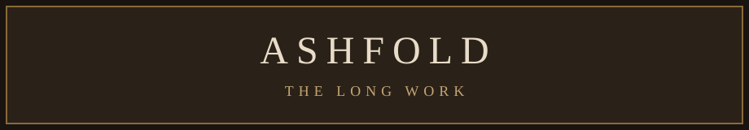

# ASHFOLD — The Long Work

Single-player mill-town game. Click to walk. Right-click (or long-press) for verbs. Twenty-six skills. Combat triangle. The grind is the plot.

You spawn on **Millwake plaza**. Street, mill door, a miller with a debt, a fishwife at the docks, a bank clerk, a bed. Not two rats and a tree.



## How to run

```bash
npm install
npm run dev
```

`npm install` also decodes the painted sprites/tiles (they live in the repo as `.b64` text so GitHub can store them). Then open the URL Vite prints.

Save data is your browser's `localStorage` key `ashfold.v1`. No accounts. No database.

## Controls

- **Click** a tile to walk there
- **Right-click** (or long-press) for the verb menu — Talk, Chop, Mine, Fish, Attack, Bank, Sleep…
- Combat is melee / ranged+arrows / magic+runes
- Death keeps your three dearest items; the rest wait on a grave

## Source map

| Path | What it is |
|---|---|
| `src/game/sim/game.ts` | Verbs, combat, skills, quests, save |
| `src/game/world/mapgen.ts` | Millwake and every region |
| `src/game/data/world.ts` | Regions, doors, creatures, NPCs |
| `src/game/data/items.ts` | Items |
| `src/game/data/progress.ts` | Quests, recipes, harvest, shops |
| `src/game/engine/render.ts` | Tiles, sprites, radar |
| `src/game/engine/path.ts` | Click-to-walk A* |
| `src/game/GameApp.tsx` | HUD |
| `public/sprites/`, `public/tiles/`, `public/art/` | Painted art (decoded on install) |
| `attachments/Ashfold_Build_Bible.pdf` | Content bible (decoded on install) |

TanStack Start + React 19 + Tailwind v4. Canvas 2D.

## GitHub, in plain English

You are looking at a **repository** (a folder of code with history).

- **Code** tab (this page) — the files. Click a folder, click a file, read it.
- Green **Code** button — **Download ZIP** if you do not want git. Or copy the HTTPS URL to clone.
- **Commits** (clock icon on this page) — every save of the project, newest first.
- **Issues** — a to-do list / bug tracker. New Issue to write one down.
- The **README** (this text) is the front door. GitHub always shows it on the repo home.

This repo is **public**: anyone with the link can see it.

```
https://github.com/VortexFractmatics/Ashfold
```
